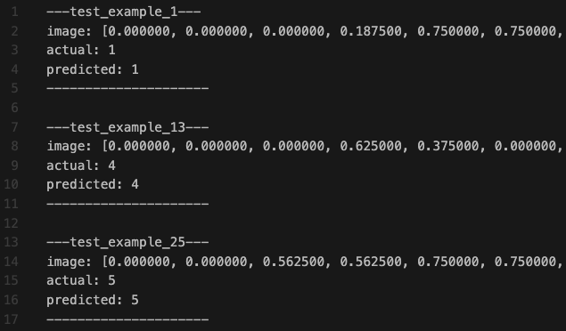

# C-NN-FromScratch
This repository contains a C program for training a neural network using backpropagation on the MNIST dataset. The code is designed to implement forward propagation, backward propagation, weight updates, and evaluate through a confusion matrix, loss (mse) and calculating accuracy.

After running the executable, a `log` folder will be created (if it doesn't already exist). This folder will contain relevant data, including CPU time, loss per epoch, and images showing the actual and predicted values for visualisation.

## Code structure
The code is structured as a library, with each component having its own header and C file. For example, neural network initialisation and creation are completely separate from training. This separation allows flexibility in the training process and enables multiple different networks to be trained in a single run.

The main components: 
- **data.c** - Functions for loading and accessing the dataset, test and training sets which is loaded at the start of the program based on the path set. 

- **metrics.c** - Functions for evaluating and writing metrics of the neural network after being trained.

- **nn_config.c** - Functions for allocating memory and initialising the neural network (neurons and weights).

- **nn_run.c** - Functions for training and predicting (forwards and backwards propagation).
 
## Requirements

- [gcc compiler](https://gcc.gnu.org/)
- decent cpu

## How to use
Assuming you are `C-NN-FromScratch` directory

1. Compile using `gcc -o {exe_name} nn.c nn_library/nn_config.c nn_library/nn_run.c nn_library/data.c nn_library/metrics.c`

2. Run using `./{exe_name} {learning_rate} {epochs} {hidden_layer_1} ... {hidden_layer_n}`

3. Navigate to the log folder for training statistics

## Example training and output
The following is run with `./nn 0.1 1000 32 16`

**Loss per 100 epochs (Terminal output)**

**test_output.txt snippet**

**training_statistic.txt**

