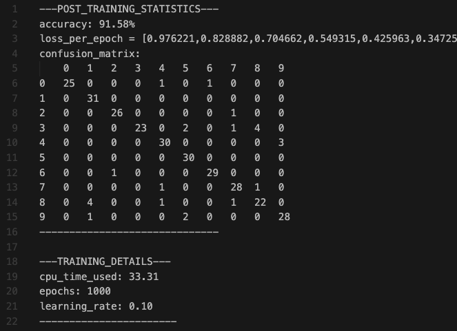

# C-NN-FromScratch
This repository contains a C program from scratch that trains a neural network using backpropagation on the MNIST dataset. It implements forward and backward propagation, weight updates, and evaluates performance with a confusion matrix, mean squared error (MSE) loss, and accuracy metrics.

After running the program, it creates a log folder (if not already present). This folder logs CPU time, epoch-wise loss, and visualisations comparing actual and predicted values for easy interpretation.

The codebase uses just four standard C libraries:

1. stdio.h
2. stdlib.h
3. math.h
4. string.h

## Code structure
The code is structured as a library (in `nn_library`), with each component having its own header and C file. For example, neural network initialisation and creation are completely separate from training. This separation allows flexibility in the training process and enables multiple different networks to be trained in a single run.

The main components: 
- **data.c** - Functions for loading and accessing the dataset, test and training sets which is loaded at the start of the program based on the path set. 

- **metrics.c** - Functions for evaluating and writing metrics of the neural network after being trained.

- **nn_config.c** - Functions for allocating memory and initialising the neural network (neurons and weights).

- **nn_run.c** - Functions for training and predicting (forwards and backwards propagation).

- **nn.c** - Main function to create and train neural networks
 
## Requirements

- [gcc compiler](https://gcc.gnu.org/)
- decent cpu

## How to use
Assuming you are `C-NN-FromScratch` directory

1. Compile using `gcc -o {exe_name} nn.c nn_library/nn_config.c nn_library/nn_run.c nn_library/data.c nn_library/metrics.c`

2. Run using `./{exe_name} {learning_rate} {epochs} {hidden_layer_1} ... {hidden_layer_n}`

3. Navigate to the log folder for training statistics

4. Run each cell in `data_visualisation.ipynb` to see graphs (requires matplotlib and numpy) 

## Example training and output
The following is run with `./nn 0.1 1000 32 16`

### Log files and output 
**Loss per 100 epochs (Terminal output)**

**test_output.txt snippet**

**training_statistic.txt**

### Visualisation based on logged data (from data_visualisation.ipynb)

**Loss per epoch**

**Test prediction visualisation**

